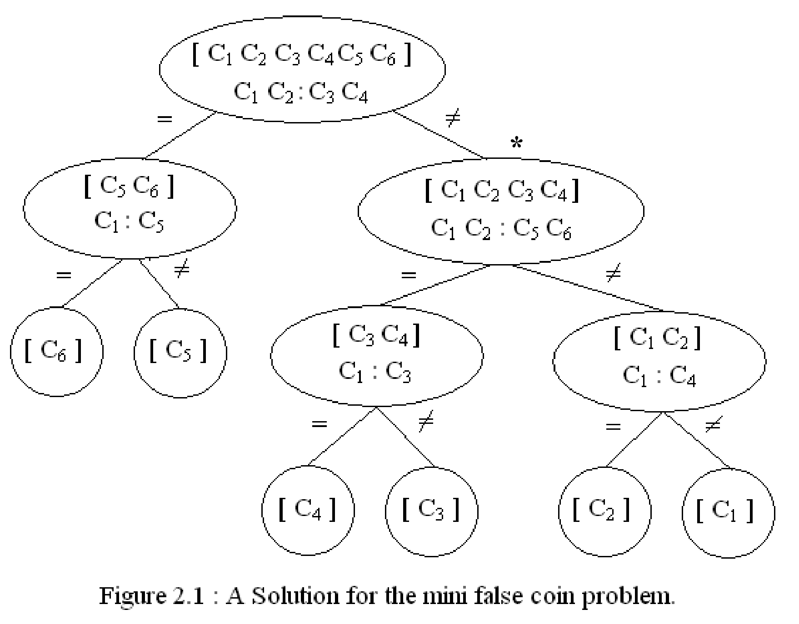

# Introduction to Artificial Intelligence

We define intelligence as the ability of an individual to learn from experience, to reason well, to remember important information, and to cope with the demands of daily living

<ol>
<th> Different Search Algorithmsk

<li> Blind-Search: no knowledge of the problem domain
<li> Depth-First-Search(dfs): A,B,D,E,C,F,G  
<li> Breadth-First-Search(bfs): A,B,C,D,E,F,G
<li> Heuristic-Search: employ estimates of closeness to goal
</ol>

# Can Machines think?

* Not a neat yes or no, but rather a highly qualified "to a certain extent under special conditions"
* It's like asking "Does a person, animal, machine possess intelligence
* ... the answer is not binary:
* Some people are smarter than others
* Some animals are smarter than others
* **Turing** rephrased this question in operational terms i.e, he sought to separate functionality  
  from implementation.
************
# The Chinese Test ~~ Turing Test
## Part 1 : Measuring Intelligence
* Alan Turing(1950) proposed two imitation games
* In the first game there is:   
  <ol>
* an interragtor, a physical curtan(|) and a man(who lies), a woman (truthful)  
* A series of questions is asked
* The interrogator must determine gender of a person on the other side
* If a man is successful in deceiving the interrogator, then we say that he has passed this imitation game
  </ol>
  
* The second ... Turing test for intelligence :  
  <ol>
* We have an interrogator, a physical curtain, a computer (that lies) and a human (truthful)  
* Loebner Prize of $100,000
* Is it a computer or a human? If the computer is successful in deceiving the interrogator then we say that it has passed the Turing Test
  </ol>
* So the computer decieved a human into thinking it the computer was human, so therefore it is intelligent.

************
## Searle's Criticism of the Turing Test
* We have an interrogator who will ask questions -this time- in Chinese, - we have an individual who does not know Chinese; that person possesses a very detailed rule book.
* To most people who don't know Chinese, the language appears as aquiggles. However the individual has a rulebook he/she can use, and is able to answer the questions. This does not mean they know chinese.
* This corresponds to computers, a computer runs programs, but that does not mean it understands the programs it's running, therefore computers are not intelligent.

# Defense of Turing (science experiment)
* **Premise**: it is not possible to gain insight on the internal state of something from external derivations
* **The Gold Foil Experiment** by Ernest Rutherford - was able to deduce the internal state of matter...mostly space, before the electron microscope. 
	* The observation should that most alpha particles travel through the foil undeflected which meant the atom is mostly empty space
	* Some alpha particles are deflected by small angles, which means the nucleus is positively charged, as is the alpha particle
	* Occasionally an alpha particle travels back from the foil, which means the nucleus carries most of the atom's mass.
* **Significance**:

## Part 2 (test questions)
* Do you agree with the following statement:  
  "All that we need to develop true A.I is faster computers" Explain...  
  NO... We need to understand intelligence, what is it? How do animals/humans develop it?  
  How do we represent knowledge. How do we foster learning?

* How (and why) did the **Turing Test for intelligence** attempt to use **functionality rather than implementation** concerns to measure intelligence? :  
  It was felt that humans would be prejudice against silicone implementations rather than blood and skin.   ... Perhaps there is intelligence on other planets quite different than that of ours.

* What was (were) Searle's objection(s) to the Turing Test? **Be specific.**
  A person who does **not** know Chinese is in a room. In that room is a rulebook for Chinese at the "squiggle level". Questions are asked in Chinese and the person must answer. *Does* this person know chinese? ... Of course not! Well... A computer runs instructions to calculate answers to questions - Does the machine understand the programs it is running?!... Of course not! ... Then how can one claim that the computer is intelligent?

* Do you have any criticism to Turing's methodology (other than what we've read?)
  Why is intelligence being equated with equivalence to a human? Perhaps there is a type of intelligence superior to human intelligence

# Functionality vs. Implementation
* Turing was trying to separate how something works **from** how it can be built
* e.g Functionality of a car:  
			     - Step on the brake ==> the car should stop  
			     - Step on the gas ==> the car should move  
			     - Turn the steering wheel left ==> car should lean left
	* **Implementation** - meanwhile an automotive factory must know about engines, brake linings, and transmssions
************
# Strong AI vs Weak AI

## Strong AI
* Strong AI is the belief that providing a computer with intelligent software somehow enables that machine to think. And it will possess consciousness much as humans do.
* Hollywood has long been a proponent of this viewpoint, where in a movie, an android wants to have his identity acknowledged.

## Weak AI
* Weak AI: intelligent behavior can be modeled and used by computers to solve complex problems.
* No presupposition is made that the computer is intelligent in the way that a human is. Most artificial intelligence researchers subscribe to this belief.

## Heuristic
* A heuristic is a "rule of thumb" for solving a problem. This is to be **contrasted** with an algorithm   
* **ALGORITHMS ARE** a definite, effective procedure guaranteed to solve a problem. 
* A **heuristic** may be helpful in solving a problem but it does not guarantee a solution.
* An example of a Heuristic:
	* Example 1: What is the diagonal of a rectangular solid?
	* The Heuristic employed: Solve a simpler but related problem. You may thereby gain insight into the original problem

# Afterword
* Problem solving via heuristics is an example of a weak method
* Heuristic methods were popular in the early days of AI - the 1950s and into the 1960s
* **STRONG** methods represented a paradigm shift in A.I. in the early 1970s with the advent of Expert Systems; there was an emphasis on the importance of knowledge in problem solving.
* An expert system possesses (some of) the expertise of a human expert in a limited domain
* MYCIN, an early(and probably best known E.S) - was capable of diagnosing bacterial infections

## Agents
* An agent is an entity that is capable of perceiving its environment and responding appropriately to it.
* If the agent is intelligent, it should be able to weigh alternatives
* This agent should be able to derive new information from data by applying sound logical rules.
* It should possess extensive knowledge in the domain where it is expected to solve problems.

**
**

### Application Areas
* We expect to communicate with this agent in a natural language such as English or Chinese
* Hence the following A.I. application areas have received much interest:
	* *Game PLaying and Puzzles*
	* *Automated Reasoning*
	* *Expert Systems*
	* *Language Understanding*

### Automated Reasoning
* Presents the software with a collection of facts
* Uses deduction
* Example: Michael and Louis each have a job. The jobs are post office clerk and French professor. Michael only speaks English and Louis holds a Ph.D. in French.
	* Who holds which job?
	* Cleary we can tell that Michael is a post office clerk
	* Louis is clearly the French Professors

#### Automated Reasoning - The Jobs Puzzle
* There are four people: Roberta, Thelma, Steve and Pete
* Among them, they hold eight different jobs
* Each holds exactly two jobs
* The jobs are:
	* chef
	* guard
	* nurse
	* clerk
	* police officer (gender not implied)
	* teacher
	* actor
	* boxer
* The job of a nurse is held by a male
* The husband of the chef is the clerk
* Roberta is not a boxer
* Peter has no education past the ninth grade
* Roberta, the chef,and the police officer went golfing together
* **Question**: who holds which jobs?

* First, one must have appropriate representation language statements such as the following are helpful in representing this problem:
	* `HAS A JOB(X, nurse)|MALE(X)
	* `HAS A JOB(Roberta, boxer)
		* these statements are called clauses. The vertical slash is interpreted as "or", the initial ` as "not"
		* Note that (pq)(p v q). Hence the first clause may be interpreted as: "If x holds the job of nurse, then x is male"
	If one were to translate the previous puzzle into a language of clauses suitable for input to a program, one would still not have sufficient information to solve this puzzle...
* We know the job of nurse is held by a male, but how would our reasoning program know that Steve and Pete are male names unless we supplied:
	* MALE(Steve)
	* MALE(Pete)
We are told that the "husband of the chef is the clerk". Once again it would be a mandatory that we supply:
	* Husbands are male...from whcih the program could deduce that the clerk is male
	* Husband are married to wives
	* And wives are (usually) female
* Hence either Roberta or Thelma is the chef
* Also "Pete has no education past the ninth grade". We would need to supply:
	* Pete cannot be any of the nurse, police officer, or teacher.
* Once the puzzle is represented in clause language and common sense or world knowledge has been supplied - we still need to specify a search methodology (a strategy)
* For example, in our puzzle we have the most specific information about Roberta and hence we might direct our reasoning program to begin with her.

* **Production rules** are used as a method of knowledge representation
	* General forms:
	* IF (condition) then action
		or
	* IF (condition) then fact
	* Used in creating expert systems
		* A portion of an expert systems
			* *if (car won't start) then check headlights*
			* *if (headlights work) then check gas gauge*
			* *if (gas tank empty) then add gasoline to fuel tank*
			* *if (headlights don't work) then check battery*
## Cellular Automata
* May be viewed as a collection of cells in n-dimensional space
* Each cell may be in any one of a small number of states, typically two

## Uncertainty Reasoning
* AI systems are plagued with uncertainity
* Chance is an inimitabale component of our existence
* Consider the following sets:
	* Set of people who are satisfied with their job
	* Set of people who are unsatisfied with their job
* It is not unusual for people to love their job and also un unsatisfied(fuzzy sets)

# Key Terms
* agent
* algorithm
* artificial
* artificial intelligence(AI)
* common sense
* heuristic
* intelligence
* Strong AI
* Weak AI
* World Knowledge

###### Everything up to this point was an overview of AI. it was a discussion of intelligence and some of the controversy surrounding a working definition of intelligence, and of course controversy over the turing test. The importance of (1) Knowledge Representation (2) Search (3) Learning. We also went over several successes that were presented (1) Expert Systems (2) Game-Playing (3) Neural Networks

# Chapter 2: Uninformed Search

## Search in Intelligent Systems
* Search is a natural part of peoples' lives
* Software that solves search problems faster are deemed to be more intelligent

## State Space Graphs
* A mathematical structure that helps to formalize the search process
* Possible alternative paths leading to a solution can be explored and analyzed
* Solution to a problem will correspond to a path through a state space graph

## The False Coin Problem
* 12 coins, 1 counterfeit
* Unknown whether the fake is lighter or heavier
* Uses a balance scale to determine
	* If any two sets weigh the same
	* One set is lighter or heavier than the other
* Solve the problem in three weighings

* Will use 6 coins instead of 12, and the notation Ci1 Ci2 : Cj1 Cj2 to indicate weighing "r" amount of coins Ci1... against "r" Coins Cj1...

* At the top level we weigh C1 C2 : C3 C4
	* If they're equal then we branch to the left knowing C1C2C3C4 are valid.
* If C1:C5 are equal then we know C6 is fake
	* If they are not then C5 is fake
* If C1C2:C3C4 is not equal then we know branch to the right knowing C5C6 are real.

## Generate and Test Paradigm
* Propose possible solutions then test whether each proposal constitues a solution
* Will illustrate with n-Queens problem
** Generate and Test ** - uses two basic modules
* The **generator** enumerates possible solutions (sometimes called hypotheses)
* The **tester** evaluates each proposed solution, either accepting or rejecting it.
* Generators should be:
	* Complete
	* Non-redundant
	* Informed
* **Complete** - they will eventually produce all possible solutions
* **Non-redundant** - they never impair efficiency by proposing the same solution twice
* **Informed** - they employ possibility limiting information thereby restricting the solutions they propose

## n-Queens Problem
* n-Queens are to be placed on an n x n board
* No two Queens should occupy the same row, column or diagonal
* Example with 4x4 board with 4 Queens

* Basically after placing the first Queen, you constantly need the tester to check that no problem constraints are violated after each portion of a proposed solution is provided.
* There are 1820 ways to accomplish this
* There's a solution where there was a Queen in each column and only 1 Queen in each row.
* This suggests that each solution is a permutation, a more informed generator would only generate permutations.

## Exhaustive Enumeration(aka British Museum Search)
* A search methodology that looks everywhere for a solution to a problem

* partial solution is developed further even after it has been discovered that this set of steps cannot possibly lead to a successful problem solution

## Backtracking
* An improvement to exhaustive enumeration
* A proposed solution is divided into stages
* In the 4-Queens problem, placing each queen on the board is a stage
* In stage i, Queens have been successfully placed in columns 1,...,i-1
* If no square remains on which the ith Queen may be placed that does not violate any of the constraints, then we must return to Stage i-1
* Undo the placement of the Queen at Stage i-1, make the next choice for this Queen, and return to Stage i. If it is not possible to succcessfully place the (i-1)st Queen, then backtracking continues to stage i-2

* Can use backtracking with generate and test
* The generator will attempt to place a Queen in each column
* The test module will view a possible solution as it is being developed
* The algorithm contains four stages

#### solving n-queens problem
1. 1st Queen is placed
2. 2nd Queen is placed but it violates one of the constraints so it is placed in a different spot
3. The new location for the 2nd Queen
4. No more Queens can be placed that will not violate any of the contraints.
5. Algorithm will backtrack and replace the 2nd Queen in the next figure

## The Greedy Algorithm
* Operates by dividing a problem into stages
* Always contains an objective function that much optimized
* Selects the locally best choice at each stage
* Suppose that a salesperson is starting from Chengdu and wants to find the shortest path to Haerbin, that is, from points v1 to v3

* In stage two, the path from v1 to v2 is taken since it is shorter than going from v1 to v5 and then to v2 ... 606+914=1520

* The total from v1 to v2 to v3 is 2579 but the path from v1 to v4 is cheapter so we go to v4

* We finally arrive at v3 using the shortest path from v1 to v2 to v3

## The travelingn salesperson
* Given n-vertices on a weighted graph
* Start at point v1 and traverse through **each vertex ONLY ONCE** and end up back at v1

* **Dijkstra's Shortest Path Alogrithm**
* **Prim and Kruskal's Algorithms** - for finding a minimum spanning tree
* However, the Greedy Method fails to find a shortest tour for the **TSP**
* An instance of the traveling salesperson problem with the **nearest neighbor path**, can be seen in the image above, the arrows are bolded.
* Note that this path (A --> E --> D --> B --> C --> A) at a cost of 550, is not the shortest path.
* The high cost of the arc ( C --> A) defeated the heuristic

## Blind Search Algorithm
### Three Principal Algorithms
1. Depth First Search(dfs)
2. Breadth First Search(bfs)
3. Depth First Search with Iterative Deepening(dfs-id)

### Two Key Properties
1. They do not use heuristics
2. Their aim is to find some solution to a problem.

## Depth First Search
* Attempts to plunge as deeply into a tree as quickly as possible
* If there is a choice, it selects the leftmost branch

### Implementing Depth First Search
* Shares an attribute with the other search algorithms
	* Maintains two lists:
		* open list - list of nodes being still being explored
		* closed list - list of nodes already explored and no longer under consideration
* Depth first search is accomplished by maintaining the open list as a stack

* We return Success G is a goal... Portion of search tree visited by depth first search. We have found some path to a goal A-->B-->E-->G1
## Breadth First Search
* Nodes are visited from the top of the tree to the bottom, from left to right
* All nodes on level i are visited before any nodes on level i+1 are visited

* BFS is optimmale when all step costs are equal. It always expands the shallowest unexpanded node.
* A variation on BFS:
	* Uniform - cost search expands the node n with the lowest path cost...if all step costs are equal, this is just BFS
	* Uniform - cost search does not take into account the number of steps a path has, but merely their total vosts...
	* to ensure completeness we assume that every step has cost greater than some small positive constant c.

## Measuring Problem Solving Performance
* Completeness - an algorithm is complete when it is guaranteed to find a solution when there is one
* Optimality - an algorithm is optimal if it provides the lowest cost path amongst all solutions
* Time Complexity - measured in the number of nodes generated during the search.
* Space Complexity - how much memory is required to perform the search. We must also determine the maximum number of nodes.

## The **branching factor**
* The **branching factor** of a node is the number of branches emanating from it.
* The branching factor of A is there
* If every node in a search tree has a branching factor of **b**, then the **branching factor of the tree** is **b**
* **d**: this parameter measures the depth of the shallowest goal node
* **m**: this parameter measures the maximum length of any path

## Comparing BFS and DFS
* BFS is preferred if
	* The branching factor is not too large (hence memory cost)
	* A solution appears at a relatively shallow level
	* No path is excessively deep
* DFS is preferred if
	* The tree is deep
	* The branching factor is not excessive
	* Solutions occur deeply in the tree

* DFS requires b^(m+1) nodes which is O(b^*m*)
* DFS is not complete and hence is not optimal
* Time complexity
	* T(n) = b+b^2+b^3+...+(b^d-1-b) = O(b^d+1)
* Every node that is generated must also remain in memory
* Space complexity (S(n)) = O(b^d+1)
* BFS is complete when the search space is finite

## DFS with Iterative Deepening (DFS-ID)
* Performs a DFS with a depth bound of 0
* If goal is not found then another dfs is performed (from scratch) with a depth bound of 1
* The search continues with depth bound increasing by one each time
* A complete DFS is performed to the current depth each time

* each tree is redrawn from scratch
* No tree is built from a tree with depth bound one lower
* Total number of nodes generated is
	* ((d+1)*1)+(d*b)+(d-1)*b^2+...+1*b^2
* Time complexity for DFS-ID is O(b^d)
* A path is erased from memory each time depth bound increases so space complexity is also O(b^d)
* DFS-ID is complete when the branching factor is finite
* Optimal when path costs are a non-decreasing function of a node's depth

### Keywords
* Backtracking State Space Graph
* Blind Search algorithms state space tree
* BFS
* Traveling Salesperson
* Closed List
* Problem
* Complete
* Optimal
* DFS
* Iterative Deepening
* Generate and Test
* Greedy Algorithm

# Summary
* Overview of blind or uninformed search algorithms including DFS,BFS, DFS-ID
* Generate and Test-Paradigm
* Exhaustive Enumeration - looks everywhere
* Backtracking - abandons partial solution dead ends
* Greedy Algorithm - a useful approach to solving some problems
* All blind search algorithms exhibit exponential time - complexity

